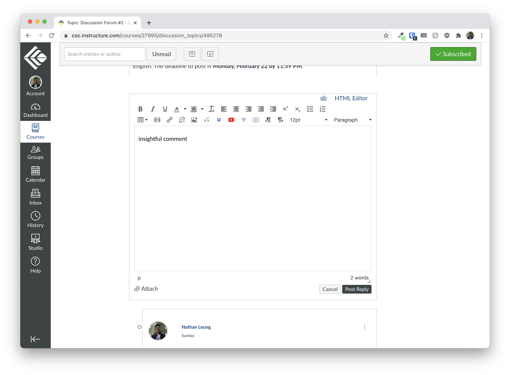
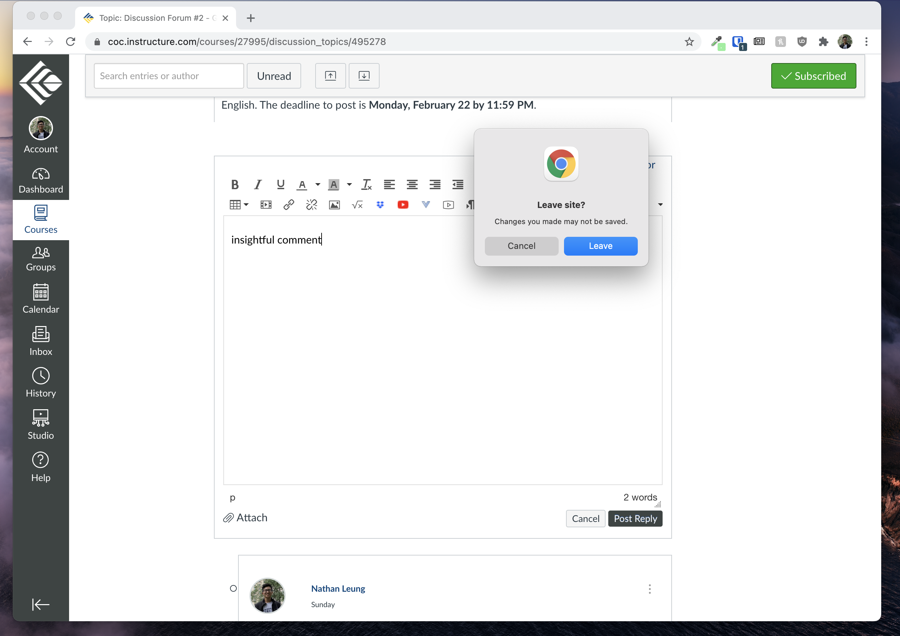

# Warn Before Closing Canvas

Have you ever had an insightful comment typed up as a Canvas discussion post response but then you accidentally closed the tab and lost your post?



This extension warns you before you close _any_ Canvas tab (i.e. any tab on a site that matches `*.instructure.com/*discussion_topics*`) so this hopefully doesn't happen to you again.



## Code

This extension is 7 lines of code long:

```js
// From https://developer.mozilla.org/en-US/docs/Web/API/WindowEventHandlers/onbeforeunload#example
function onBeforeUnload(e) {
  e.preventDefault();
  e.returnValue = "";
}

window.addEventListener("beforeunload", onBeforeUnload);
```
